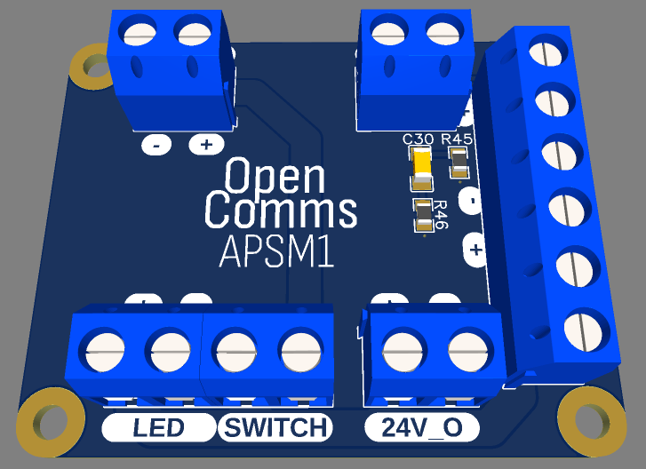
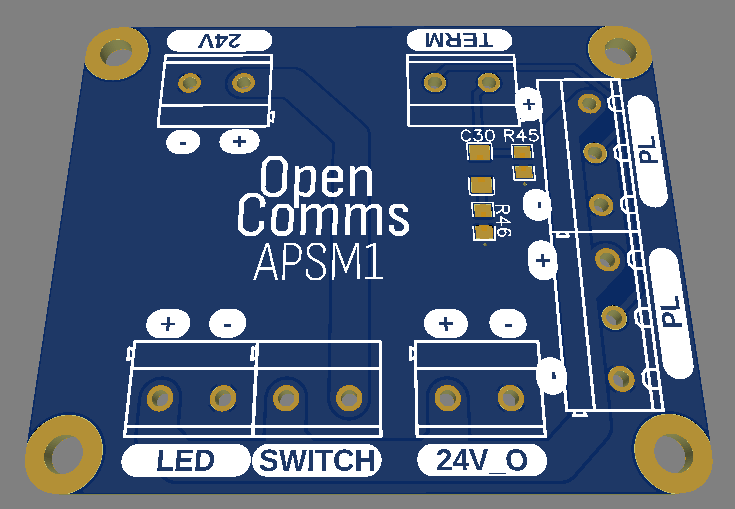

# APSM1 (Analog power supply module 1)

The APSM1 is a customizable power supply module for analog partyline communication systems. APSM1 serves as a valuable resource for hobbyists seeking to build their own partyline power supply units. 

## Concept
The APSM1 was designed for simplicity and modularity. It's a very simple breakout module with integrated line terminaison. The APSM1 module serves as a starting point for someone looking to build their own patyline power supply

The module is composed of:

 - One DC input (`24v-30v`)
 - One button connector (with LED output)
 - One switched DC output
 - Two partline outputs (same line, just two outputs to split power) `GND`, `DC`, `Partyline`
 - Switchable terminaison circuit (`Signal -- 200ohm --||-- GND` and `Signal -- 2.2k -- GND`) 

## PCB & Schematics
 - Schematic: [[PDF]](electronics/SCH_PDF_OpenComs_APSM1_2023-05-12.pdf) [[EasyEDA]](electronics/SCH_EasyEDA_OpenComs_APSM1_2023-05-12.json) [[Altium]](electronics/SCH_Altium_OpenComs_APSM1_2023-05-12.schdoc)
 - PCB: [[EasyEDA]](electronics/PCB_EasyEDA_OpenComs_APSM1_2023-05-12.json) [[Altium]](electronics/PCB_Altium_OpenComs_APSM1_2023-05-12.pcbdoc) [[Gerber]](electronics/PCB_Gerber_OpenComs_APSM1_2023-05-12.zip)
 - Bom: [[CSV]](electronics/BOM_OpenComs_APSM1_2023-05-12.csv)

## Cost

The overall cost of this device is very low.

Here is an simplified BOM:

| What | Bought were | Cost |  Quantity | Comment |
|------|-------------|------|-----------|---------|
| PCB | JLCPCB | 3.62eur | 5 |  |
| Parts | Anywhere | few cents | 5 |  |
| Screw terminals | Anywhere | few euros | 5 |  |

*Note that some of the part here can be salvaged or found for way cheaper, which will bring the cost down even more*